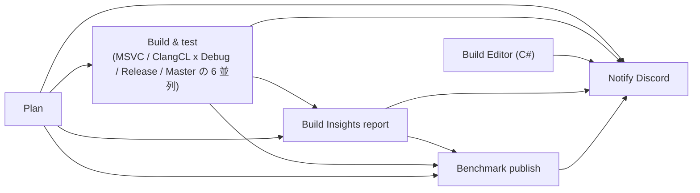

# CI 早見表

`.github/workflows/` のワークフローが「何のためのものか」「いつ動くか」「落ちたら何を見るか」を 1 か所にまとめた資料です。
GitHub の Actions 画面にはワークフローの説明欄がなく、名前 (`CI` / `CodeQL` など) だけでは中身が分かりにくいので、この文書を見てください。
詳細は各 `.yml` の冒頭コメントが正本です (この文書と食い違ったら yml 側が正しい)。

## 一覧

| ワークフロー | 一言でいうと | いつ動く | 落ちると |
| --- | --- | --- | --- |
| [CI](#ci-ciyml) | runtime (C++) と Editor (C#) をビルドし、テストと起動確認を走らせる本体 | push (全ブランチ。文書だけの変更は除く) / 手動 | ビルド・テスト・起動確認の失敗。master に入れる条件を満たさない |
| [File format](#file-format-file-formatyml) | BOM と改行コードの意図しない変更を拾う | push (全ブランチ) / 手動 | 形式を直すコミットを足す |
| [Secret scan](#secret-scan-secret-scanyml) | API キーなどの秘密情報と、書いてはいけない外部資料の名前の混入を拾う | push (全ブランチ) / PR / 手動 | 混入を消す。漏れた鍵は無効化して差し替える |
| [Workflow lint](#workflow-lint-workflow-lintyml) | CI の yml と Python スクリプトの書き間違いを拾う | `.github/**` を変えた push / 手動 | CI の書き間違いを直す |
| [CodeQL](#codeql-codeqlyml) | Editor (C#) のセキュリティ・品質の静的解析 | master への push / master 宛ての PR / 毎週月曜 13:21 JST / 手動 | Editor のビルドか解析の失敗で赤になる。指摘は Security タブ (PR ではチェック) に出る |
| [clang-tidy](#clang-tidy-clang-tidyyml) | runtime (C++) の静的解析 (今は報告だけ) | 毎日 02:37 JST (master) / 設定を変えた push / 手動 | 指摘では落ちない。ビルドや集計が失敗したときだけ赤になり Discord に通知 |
| [Benchmark publish](#benchmark-publish-bench-publishyml) | ベンチマーク結果ページを作って GitHub Pages に公開する | CI の最後 (自動で呼ばれる) / ページを変えた push / 手動 | 結果ページが更新されない。CI の run も赤くなる (ビルドやテストの失敗ではない) |
| [Dev report](#dev-report-dev-reportyml) | master のコミットを AI がレビューして Discord に投稿する | 毎日 01:07 JST / 毎週月曜 01:17 JST / 手動 | 投稿されない (開発のゲートではない) |
| [Claude](#claude-claudeyml) | PR / Issue のコメントに `/claude` と書いたときだけ Claude が答える | コメント・レビューの投稿時 (`/claude` で始まるものだけ反応) | 返事が来ない |

分類すると次のとおりです。

- **master に入れる条件** (`AGENTS.md` の「master へ入れる条件」): CI の `Build & test` と `Build Editor (C#)`、File format。
  リポジトリのルールセットが必須チェックにしているものは、条件を満たさないと仕組みで止まります (具体名はルールセットを参照)。
  Secret scan は AGENTS.md の条件一覧にはありませんが、秘密情報の混入を止める関門です。
- **CI 自体の検査**: Workflow lint。
- **定期・補助の解析**: CodeQL / clang-tidy。
- **報告・公開・手動呼び出し**: Benchmark publish / Dev report / Claude。

## 各ワークフローの説明

### CI (`ci.yml`)

push のたびに runtime をビルドし、GoogleTest と Editor の UI テスト (FlaUI) まで走らせる、このリポジトリの本体です。
ビルドとテストは Windows ランナーで動きます (runtime が Visual Studio 2026 のツールセット v145 を要求するため `windows-latest`)。
Plan / Build Insights report / Notify などの小さいジョブは ubuntu で動きます。

ジョブの関係は次のとおりです。

| ジョブ | 何をするか |
| --- | --- |
| Plan | runtime のビルドを前の run から再利用できるか決める (ubuntu、数秒) |
| Build & test (6 並列) | 構成ごとに runtime をビルドし、起動確認・GoogleTest・ベンチマーク・FlaUI までを 1 ジョブの中で走らせる |
| Build Editor (C#) | Editor (`Editor/Studio.slnx`) を Debug / Release で建てる |
| Build Insights report | MSVC ビルドの計測 (どのヘッダ・テンプレートが重いか) をレポートにまとめる |
| Benchmark publish | 下記の Benchmark publish を呼ぶ |
| Notify Discord | 落ちたとき・落ちた状態から戻ったときだけ Discord に流す。成功が続く間は何も流さない |

`Build & test` の 6 構成は、コンパイラ (MSVC / ClangCL) と構成 (Debug / Release / Master) の組み合わせです。
Dependabot の Editor 用 NuGet 更新ブランチ (`dependabot/nuget/**`) だけは、C++ に影響しないので MSVC / Debug の 1 ジョブに縮みます。

| 構成 | 見ているもの | 走るもの |
| --- | --- | --- |
| Debug | 最適化なしの構成 (`NOX_DEBUG`) | 起動確認 / GoogleTest / ベンチ (各 1 回通すスモークのみ) / FlaUI |
| Release | 最適化で初めて出る不具合 | 起動確認 / GoogleTest / ベンチ (計測) / FlaUI |
| Master | `NOX_DEVELOP` が 0 の出荷構成のコンパイル | 起動確認 / ベンチ (計測)。GoogleTest はテスト型が生成されないため、FlaUI は Editor と繋ぐ口が消えるため走らない |

- ClangCL は MSVC が見逃す非適合を拾う必須の関門です。落ちたら原因を直し、無効化で回避しません。
- FlaUI (Editor の UI 自動テスト) は MSVC の Debug / Release では全テスト、ClangCL の Debug / Release では Editor と `runtime.exe` の接続テスト 1 件だけを走らせます。
- 起動確認 (`runtime.exe` の起動・終了) は 6 構成すべてで走ります。

`Build & test` で落ちうるステップのうち、主なもの:

| 落ちたステップ | 意味 |
| --- | --- |
| Build runtime.slnx | コンパイルエラー。ClangCL だけ落ちたなら、MSVC が通す非適合 |
| Run runtime.exe (start / exit) | `runtime.exe` が起動・終了でクラッシュまたはハングした。ログにスタックや Windows のイベントログが出る |
| Run GoogleTest suites | `kernel_test` / `core_test` のどれかが失敗 |
| 実行件数を確かめる | テスト件数が下限 (`ci.yml` の `--min`) を割った。テストの登録漏れやフィルタの書き間違い |
| Run benchmarks | ベンチがクラッシュ・アサート・件数不足、または 1 op あたりの確保回数が予算 (`alloc_budget`) を超えた。実行時間の変化だけでは落ちない |
| Run FlaUI tests | Editor の UI テスト、または Editor と `runtime.exe` の接続テストの失敗 |
| Restore runtime cache (reuse) | 再利用する予定だった検証済みキャッシュが追い出された。「Re-run all jobs」で Plan からやり直すとフルビルドになる |

ほかにテスト・ベンチ・Editor のビルド (`Build test projects` / `Build bench_test` / `Build Editor/Studio.slnx`) や `Verify RuntimeTypeDB exists` も落ちえます。

**再利用 (reuse)**: runtime に効く入力 (Editor・文書・`tools` の一部などを除いた全部。`.github` を変えると効く側) が、検証済みの run と同じ push では、6 構成のビルドとテストを飛ばします。
キャッシュした `runtime.exe` と TypeDB を戻して、Editor のビルドと FlaUI だけを走らせます。
ここでの「検証済み」は runtime 側 (ビルド・起動確認・GoogleTest・件数・ベンチ) だけで、FlaUI は含みません (FlaUI は毎回走る)。
再利用した run では Build Insights report は飛び、ベンチも計測しません。
master は常にフルで建てます。手動実行 (`workflow_dispatch`) で `full` を付けてもフルで建てます。
FlaUI だけ落ちて直すときは「Re-run all jobs」を使ってください。

文書だけの変更 (`**.md` / `docs/**` など) では CI は走りません。

### File format (`file-format.yml`)

BOM と改行コード (CRLF / LF) の意図しない変更を検査します。ubuntu で数秒です。
文字コードは BOM なしの UTF-8 に統一していて、改行コードはファイルごとに混在しているため、「元の形式を保つ」規約を変更前後の比較で機械化しています。

- 落ちる例: BOM の付け外し、改行コードの一括変換、CRLF のファイルへの LF 行の混入 (部分的な書き換え)、新規ファイル内の改行の混在。
- 作業ブランチは master との分岐点から累積で比べるので、壊しても直すコミットを足せば通ります。
- 意図して変えるときは、コミットメッセージに `Format-Change: <パス or glob>` を書きます。
- 手元でも `python3 .github/scripts/check-file-format.py --base origin/master` で同じ検査ができます。

### Secret scan (`secret-scan.yml`)

API キーやトークンなどの秘密情報の混入を、push と PR の差分から検査します。
本体は `noxitro/github-templates` の共通ワークフローです。AGENTS.md の「外部資料の名前を書かない」規約 (禁止する名前の混入) もここで検査されます。
文書だけの変更も検査の対象です。

### Workflow lint (`workflow-lint.yml`)

CI 自身の書き間違いを push の時点で拾います。`.github/` 以下を変えた push だけで走ります。

- actionlint: ワークフローの構文・式・`needs` / `matrix` / `permissions` の整合と、`run:` の bash (shellcheck)。
- ruff: `.github/scripts` の Python (構文エラーと未定義の名前・未使用の import など)。

### CodeQL (`codeql.yml`)

GitHub の静的解析で、Editor (C#) のセキュリティ・品質の問題を探します。指摘は Security タブに出ます。
C++ (runtime) は対象外です。Windows ランナーで manual build mode を組む必要があり、まだ着手していません。

### clang-tidy (`clang-tidy.yml`)

runtime (C++) を clang-tidy で解析し、バグ・未定義動作・性能の問題を拾います。検査の種類は `runtime/.clang-tidy` です。
今は報告だけで、指摘があっても CI は落ちません。ClangCL / Debug で `runtime.slnx` を建てながら走るので、push ごとのビルドとは別枠です。

- 毎日 master で走り、総数と新しく出た指摘を Discord に投稿します (新しい指摘があれば黄、無ければ灰)。
- 設定やスクリプトを変えた push でも走りますが、Discord には投稿しません (設定の確認用)。
- ビルドや集計が失敗したときは、ワークフローが赤くなり、Discord にも失敗を通知します。

### Benchmark publish (`bench-publish.yml`)

CI の各構成で計測したベンチマーク結果を master の履歴に積み、結果ページ (`tools/bench-site`) を作り直して GitHub Pages に公開します。
CI の最後から自動で呼ばれるほか、ページだけを直した push では単独で走ります (計測はせずページだけ作り直す)。
master 以外のブランチでは公開せず、そのブランチの結果を重ねたプレビューをアーティファクト `bench-site` に置きます。
master で悪化または確保回数の予算超過があれば Discord に投稿します。

### Dev report (`dev-report.yml`)

master に入ったコミットを毎日 AI にレビューさせ、週に一度は活動を総括して Discord に投稿します。中身は `.github/scripts/dev-report.py` です。
開発のゲートではなく、落ちても master には影響しません。このワークフローかスクリプトを変えた push では、投稿せずに内容だけ確かめる dry-run で走ります。

### Claude (`claude.yml`)

PR や Issue のコメント・レビューの先頭に `/claude` と書き、空白か改行を挟んで頼んだときだけ反応します (例: `/claude review`)。
Claude が差分をレビューしたり質問に答えたりします。レビューの基準は `CLAUDE.md` (→ `AGENTS.md`) です。

- ワークフロー自体はコメントのたびに起動するので、Actions の一覧にはコメントごとに run が出ます (反応しないものはスキップされる)。
- 自動レビューは走りません。PR ごとに走らせると重複が多く、利用枠も減るためです。
- `issue_comment` で起動するので、使われるのは master にある版です。変更は master に入ってから効きます。

## 補足

- 作業ブランチ (`work/*` など) の push では、CI・File format・Secret scan が走ります。Workflow lint は `.github/` を変えたときだけです。
- 検証は CI に任せ、ローカルでビルド・テストはしない運用です (`AGENTS.md`)。ローカルで建てる手順は [local-build.md](local-build.md)。
- ワークフローを足す・変えるときは、この表も更新してください。
